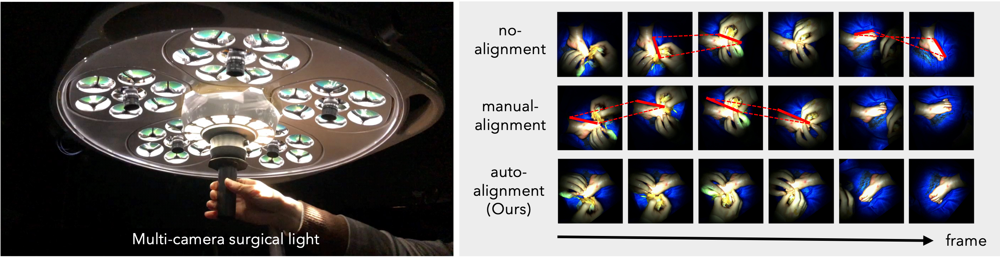

# Single View Surgical Video
Code for MICCAI2023 paper entitled "High-Quality Virtual Single-Viewpoint Surgical Video: Geometric Autocalibration of Multiple Cameras in Surgical Lights".

## Overview
Occlusion-free video generation is challenging due to surgeons' obstructions in the camera field of view. Prior work (Camera Switching<sup>[1]</sup>) has addressed this issue by installing multiple cameras on a surgical light, hoping some cameras will observe the surgical field with less occlusion. However, this special camera setup poses a new imaging challenge since camera configurations can change every time surgeons move the light, and manual image alignment is required. This paper proposes an algorithm to automate this alignment task.
Both quantitative results and a user study involving medical doctors show that our method outperforms conventional approaches.




## Installation
The hardware environment for this demonstration is as follows: 
- OS: Ubuntu 20.04.5 LTS
- CPU: 12th Gen Intel(R) Core(TM) i9-12900
- GPU: NVIDIA GeForce RTX 3080
- RAM: 62GiB
```
git clone https://github.com/isogawalab/SingleViewSurgicalVideo.git
cd SingleViewSurgicalVideo
conda env create -f environment.yml
conda activate sv2
```

## Running demo
1. [Download sample videos.][]
3. Put all videos in `data/videos/input`
4. Perform `python runningDemo.py ./data`
5. You'll see five aligned videos in `data/videos/output`
6. Perform the camera selection method of Shimizu et al.<sup>[1]</sup>

[Download sample videos.]: https://keio.box.com/s/1akz8ox54xksm8rwj2dfuf3nvb9282np "sample videos"


## Citation
If you find our work useful in your research, please consider citing our paper:
````
@InProceedings{Kato_2023_MICCAI,
author = {Kato, Yuna and Isogawa, Mariko and Mori, Shohei and Saito, Hideo and Kajita, Hiroki and Takatsume Yoshihumi.},
title = {High-Quality Virtual Single-Viewpoint Surgical Video: Geometric Autocalibration of Multiple Cameras in Surgical Lights},
booktitle = {Medical Image Computing and Computer Assisted Intervention – MICCAI 2023},
year = {2023},
}
````

## Reference
[1] Tomohiro Shimizu, Kei Oishi, Ryo Hachiuma, Hiroki Kajita, Yoshihumi Takatsume and Hideo Saito.: Surgery recording without occlusions by multi-view surgical videos. In: 15th International Joint Conference on Computer Vision, Imaging and Computer Graphics Theory and Applications, VISIGRAPP 2020 (VISAPP). pp. 837‒844 (2020).

[2] Mizuki Obayashi, Shohei Mori, Hideo Saito, Hiroki Kajita and Yoshihumi Takatsume.: Multi-view surgical camera calibration with nonefeature-rich video frames: Toward 3d surgery play-back. Applied Sciences 13(4): 2447 (2023).

[3] Paul-Edouard Sarlin, Daniel DeTone, Tomasz Malisiewicz and Andrew Rabinovich.: SuperGlue: Learning Feature Matching with Graph Neural Networks. In: Proceedings of the IEEE/CVF Conference on Computer Vision and Pattern Recognition (CVPR). pp. 4938-4947 (2020).
